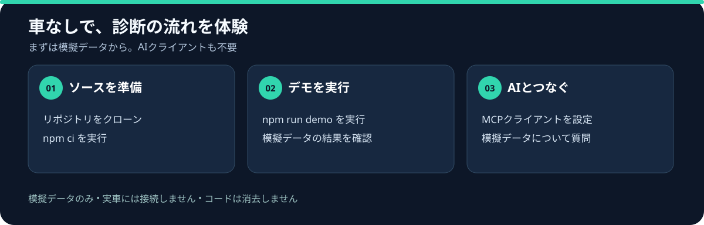

# obd2-mcp

**[実際の出力を見る・AIクライアントなしでデモを実行する](./docs/demo-results.md)**

**開発に参加する：** [初めての方向けIssue](https://github.com/shoka-jp/obd2-mcp/issues?q=is%3Aissue%20is%3Aopen%20label%3A%22good%20first%20issue%22)から選べます。[貢献ガイド](./CONTRIBUTING.md)もご覧ください。ドキュメント修正・テスト・質問を日本語でも歓迎します。[感想・質問を送る](https://github.com/shoka-jp/obd2-mcp/issues/new?template=first-experience.yml)（GitHub上で公開されます）。



**車もAIクライアントも不要：** Node.js 22または24とnpmを用意し、ターミナルで次を実行してください。ビルド済みパッケージと依存ライブラリを取得するので、Gitの操作や手元でのビルド作業を省けます。

```bash
npm exec --yes --package=https://github.com/shoka-jp/obd2-mcp/releases/download/v0.3.0/obd2-mcp-0.3.0.tgz -- obd2-mcp --demo --summary --lang ja
```

このリポジトリの[v0.3.0リリース](https://github.com/shoka-jp/obd2-mcp/releases/tag/v0.3.0)に添付したパッケージを取得し、模擬データと確認手順を表示して終了します。[出力例と確認事項を見る](./docs/demo-results.md)。

**模擬車両の結果例：** 記録コード `P0420`、記録時は時速98 km・2,210 rpm、現在値は時速0 km・740 rpm。模擬データであり、故障診断ではありません。[実際の取得結果と限界を見る](./docs/demo-results.md#observed-output--実際に取得した結果)。

ツールの応答全体を見る場合は `--summary --lang ja` を外します。開発やソースからのMCPクライアント接続は、下のクイックスタートを参照してください。

**初めての方へ：[車なしで試せるモック体験ガイド](./docs/try-mock.md#日本語)**

[English](./README.md) | **日本語**

[](./LICENSE)

安価なELM327アダプタ経由で、AIアシスタントが**あなたの車のOBD-IIデータを直接読める**ようにするMCPサーバーです。故障コード(DTC)、ライブセンサー、フリーズフレーム、レディネスモニタ、車台番号(VIN)に対応。

Claudeに「エンジン警告灯が点いたのはなぜ?」と聞くと、**実車から実際のコードを読み取り**、消える前にフリーズフレームを確保し、燃料補正を確認して原因を推論します — スキャナーの画面を手で書き写す必要はもうありません。

**アダプタがなくても動きます。** 内蔵のモック車両(暖機済みアイドリング中のセダン、P0420記録済み、警告灯点灯、リアルなライブデータ)で、アダプタを買う前にすべて試せます。

## クイックスタート(モックモード — ハードウェア不要)

GitとNode.js/npmを用意し、ソースからビルドします。npm経由で導入する場合は、先にパッケージの公開状況を確認してください。

```bash
git clone https://github.com/shoka-jp/obd2-mcp.git
cd obd2-mcp
npm ci
npm run build
node -p "require('node:path').resolve('dist/index.js')"
```

以下の `/absolute/path/to/obd2-mcp/dist/index.js` は最後のコマンドで表示された実際の絶対パスに置き換えてください。WindowsのJSON設定では区切り文字に `/` を使用できます。

**Claude Code:**

```bash
claude mcp add obd2 -- node "/absolute/path/to/obd2-mcp/dist/index.js"
```

**Claude Desktop**(`claude_desktop_config.json`):

```json
{
  "mcpServers": {
    "obd2": {
      "command": "node",
      "args": ["/absolute/path/to/obd2-mcp/dist/index.js"]
    }
  }
}
```

そして聞いてみてください:「車の故障コードを読んで、お金を使う前に確認すべきことを教えて」

### 別のモックシナリオを試す

MCPクライアントの設定で `OBD2MCP_CONNECTION=mock` と合わせて `OBD2MCP_MOCK_SCENARIO` を指定できます。`catalyst`（既定、P0420）、`healthy`（コードなし）、`misfire`（P0301）、`lean`（P0171と高めのバンク1燃料補正）から選べます。いずれも学習用の模擬データで、実車の故障診断や車両プロファイルを保証するものではありません。未対応のシナリオ名では起動を停止します。実車接続時にはこの設定を使用しません。

たとえばClaude Codeに別のモックサーバーを登録します。

```bash
claude mcp add obd2-lean --env OBD2MCP_CONNECTION=mock --env OBD2MCP_MOCK_SCENARIO=lean -- node "/absolute/path/to/obd2-mcp/dist/index.js"
```

設定変更後はサーバーを再起動してください。モックの状態はサーバーごとに独立しています。モックの消去はレディネスをリセットしますが、実車には影響しません。

## 整備相談レポート

v0.3.0のMCPサーバーをクライアントに設定すると、**「read_diagnostic_reportを実行し、観測値・未取得項目・エラーを整備相談用のメモにまとめて。フリーズフレームと現在値は分けて」**と依頼できます。

故障コード・フリーズフレーム・ライブセンサー・レディネスを1回の呼び出しで取得し、取得時刻付きのJSONにまとめます。既存の読み取り処理を利用し、一部が取得できなくても、ほかの結果と未取得項目・エラーを残します。順番に読み取るため、同一瞬間の値とは限りません。

必要なライブセンサーだけを読み取るには、たとえば `{"pids":["rpm","coolant_temp"]}` のようにPIDの**名前**を指定します。`pids`を省略するか空配列にすると、`read_live_data`と同じ既定の項目を取得します。不明な名前はセンサーごとのエラーとして残し、ほかの指定項目は引き続き読み取ります。この指定が適用されるのはライブデータだけで、故障コード・フリーズフレーム・レディネスは通常どおり収集します。

VINの取得やコード消去は行わず、接続元を示す`source`フィールドも省きます。エラー文には機器情報が含まれる場合があるため、共有前に本文を確認してください。MCPクライアント側で保存・整形して相談に使う記録であり、実車の故障診断を確定するものではありません。

## 実車への接続

ELM327互換アダプタ（USB / Bluetoothシリアル / WiFi）をOBD-IIポートに接続し、イグニッションをONにします。対応状況は車種・販売地域・通信規格・アダプタ・接続方式によって異なり、このプロジェクトでは実車とアダプタの組み合わせをまだ検証していません。停車中に読み取り専用の確認から始めてください。アダプタへの接続だけでは車両との通信は確認できません。

接続先は環境変数またはCLIフラグで指定:

| アダプタ | 設定 |
|---|---|
| USB / Bluetooth(シリアル) | `OBD2MCP_CONNECTION=serial:COM3`(Windows)/ `serial:/dev/ttyUSB0`(Linux)/ `serial:/dev/tty.usbserial-XXXX`(macOS) |
| WiFi | `OBD2MCP_CONNECTION=tcp:192.168.0.10:35000` |
| モック(デフォルト) | `OBD2MCP_CONNECTION=mock` |

シリアルのボーレートは既定38400。必要なら`OBD2MCP_BAUD=115200`で変更。BluetoothアダプタはOS側でペアリングしてシリアルポートとして見える状態にしてください。

実車接続でのClaude Code登録例:

```bash
claude mcp add obd2 --env OBD2MCP_CONNECTION=serial:COM3 -- node "/absolute/path/to/obd2-mcp/dist/index.js"
```

## 対応するライブセンサーの確認

センサーを選ぶ前に、MCPクライアントで `read_supported_pids` を実行できます。このサーバーが使用する16進数のPID `01`〜`60` の範囲について、後続の対応表があることを示すビットを確認しながらMode 01の対応情報を読み取ります。返された `supported_sensor_names` を、`read_live_data` や `read_diagnostic_report` の `pids` に指定できます。

センサーごとに `supported`（車両が対応を通知）、`not_advertised`（対応ビットまたは後続の対応表の通知なし）、`unknown`（必要な応答を取得できず不明）を区別します。途中で失敗した場合は `complete: false` とツールエラーを返し、それまでの結果と失敗したリクエストを残します。`NO DATA`・不足した応答・曖昧な応答を「非対応」の証拠として扱いません。呼び出しごとに再取得し、センサー値の読み取り・VIN取得・コード消去は行いません。

次の読み取りに渡すのは、**1件以上**の対応センサー名にしてください。`pids: []` は引き続き既定の項目を取得します。対応の通知は値の取得成功を保証せず、`complete` は上記のPID範囲だけを指します。モックとプロトコルのテストによる検証であり、実車・アダプターとの互換性は未検証です。

プロトコルの参考資料：[ELM327データシートの「Talking to the Vehicle」](https://elmelectronics.com/wp-content/uploads/2020/05/ELM327DSL.pdf)、[python-OBDのコマンド表](https://python-obd.readthedocs.io/en/latest/Command%20Tables/)。

## ツール一覧

| ツール | 内容 |
|---|---|
| `read_supported_pids` | ライブセンサーの対応通知を確認。不明や途中の取得失敗を保持 |
| `read_diagnostic_report` | 4種類の読み取り結果を取得時刻・未取得項目・エラー付きでまとめる整備相談用レポート。ライブセンサーを選択可能 |
| `read_dtcs` | 記録済み・保留中の故障コード、警告灯の状態、コード数。アダプターがデータを返さない場合、該当する一覧は `null`（未確認）です。 |
| `read_freeze_frame` | フリーズフレームを記録させたDTCと、その瞬間のエンジン状態 |
| `read_live_data` | ライブセンサー:回転数、水温、燃料補正、MAF、O2電圧など(22 PID) |
| `read_readiness` | レディネスモニタの完了状態(検査に通る状態かの判定材料) |
| `read_vin` | ECUから車台番号を読み取り |
| `connection_status` | アダプター情報と取得できた場合のポート電圧。アダプターへの接続だけでは車両との通信は確認できません。 |
| `clear_dtcs` | コード消去 — **実車では初期状態で無効**。フリーズフレームが消え、モニタがリセットされます |

## automotive-ai-skills との連携 🔧

このサーバーは「道具」レイヤーです。「知識」レイヤー — コードから原因への推論方法、部品を買う前に試すべきテスト、プロに任せる境界 — は [automotive-ai-skills](https://github.com/shoka-jp/automotive-ai-skills) が担います:

```text
/plugin marketplace add shoka-jp/automotive-ai-skills
/plugin install automotive-ai-skills@automotive-ai-skills
claude mcp add obd2 -- node "/absolute/path/to/obd2-mcp/dist/index.js"
```

両方入れると、Claudeが実車からコードを読み、**その上で診断ワークフローを回します**。

## 安全設計とスコープ

- **実車のコード消去は初期状態で無効です。** モード04を使うには、サーバー起動前に `OBD2MCP_ENABLE_CLEAR=1` を設定し、`confirm` 引数を true にしたうえで、別途表示されるMCP確認フォームで承認してください。フォーム確認に非対応のクライアントでは実車の消去はできません。確認が人に提示されることはクライアントに依存し、サーバー側では承認者の本人確認はできません。モックでは消去をテストできます。
- **応答の制限。** 複数ECUの応答や混在した応答、未対応の圧縮着火エンジンのレディネスは、推測せずエラーを返します。車台番号の読み取りは、データ項目数 `01` に続く有効な17文字のCAN形式の応答に対応し、それ以外の形式ではエラーを返します。アダプターのタイムアウトや切断後はサーバーを再起動してください。実車とアダプターでの互換性は別途確認が必要です。
- **診断の支援であって、判決ではありません。** コードは「失敗したテスト」を示すもので「壊れた部品」ではありません。お金を使う前に物理テストで確定させ、安全系(ブレーキ、燃料、SRS、高電圧)はプロに任せてください。
- 運転しながらAIとやり取りしないでください。読み取りは停車中に。

## 開発

```bash
git clone https://github.com/shoka-jp/obd2-mcp.git
cd obd2-mcp
npm ci
npm test        # ビルド+モック車両に対するstdioスモークテスト
npm run test:package  # 配布用tarballを別環境へインストールして検証
```

モック車両はELM327プロトコルレベルで応答するため、テストはパース系全体(マルチフレームのVIN応答含む)を通ります。

## ロードマップ

現在のリリース状況、今後の改善案、参加方法は[開発ロードマップ](./docs/roadmap.ja.md)をご覧ください。優先順位は利用者の声に応じて見直し、公開時期は確約していません。

## プロジェクトを応援する

役立った方は、次の方法で開発を応援していただけます。

- [開発者をフォロー](https://github.com/shoka-jp)して、自動車 × AIの開発をチェックする。
- リポジトリをStarして保存したり、必要としている人に紹介する。
- [Issue](https://github.com/shoka-jp/obd2-mcp/issues)で、試した手順・期待した結果・実際の結果を共有する。ログから車台番号などの個人情報を取り除いてください。
- [GitHub Sponsors](https://github.com/sponsors/shoka-jp)でオープンソース活動を支援する。

## ライセンス

[MIT](./LICENSE) © 2026 Sho Kamakura
